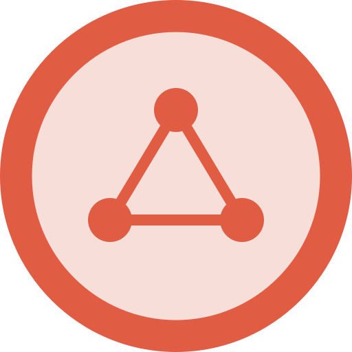

# etecoons Shared Assets 

**v3.0.1 — Shared styles, Rust components, and backend helpers for the
etecoons companion applications (`beam`, `grid`, `pad`, `todo`, `trace`).**

---

## Overview

This repository collects everything that is reused across every etecoons
companion app: the shared CSS themes and layouts, the browser-side Yew UI
chrome, and the server-side axum middleware, configuration parsing, and PIN
authentication. Starting with v3.0.0 the Rust side is split into a 3-crate
Cargo workspace (`shared-core`, `shared-backend`, `shared-frontend`) so each
consumer can depend on exactly the slice it needs without pulling in the
other half of the stack.

v3.0.1 adds a `shared-core::types` module with the on-the-wire data types
that both the Yew frontend and the axum backend need to agree on (todo
items, site config, PIN auth request/response shapes, etc.).

---

## Architecture

```
                          ┌──────────────────────────────────────┐
                          │       shared-assets v3.0.1           │
                          │     (this repository)                │
                          └──────────────────────────────────────┘
                                           ▲
                  ┌────────────────────────┼────────────────────────┐
                  │                        │                        │
   shared-core (types+i18n)    shared-backend (axum)   shared-frontend (Yew)
                  │                        │                        │
             types::TodoItem       server::ServerConfig    components::Header
             types::SiteConfig     server::serve            components::Footer
             i18n::Language        auth::pin_auth_layer     theme::Theme
             i18n::strings         middleware::cors        theme::mapping
                                  middleware::security_headers
                                  security::print_unauthorized
                                           ▲
                                           │
                                    styles/  (CSS, consumed by Trunk)
```

* **`shared-core`** — platform-agnostic primitives: wire-format data types
  (`types::*`) and i18n enums/string lookup (`i18n::*`). No runtime
  dependencies on a web framework.
* **`shared-backend`** — axum server primitives: configuration, bootstrap,
  PIN auth, shared middleware. Depends on `shared-core`.
* **`shared-frontend`** — Yew 0.23 components, theme management, and browser
  glue. Depends on `shared-core`. Built into the WASM bundle via Trunk.
* **`styles/`** — shared CSS, consumed by every companion app's frontend.

---

## Repository Layout

```
shared-assets/
├── LICENSE                              Apache-2.0
├── README.md                            this file
├── CHANGELOG.md                         release notes
├── styles/                              Shared CSS, organized by concern
│   ├── themes/themes.css                Super Metroid color tokens & themes
│   ├── layout/header.css                Top navigation bar
│   ├── layout/footer.css                Bottom footer
│   ├── components/body.css              Page body & containers
│   ├── pages/login.css                  PIN entry screen
│   └── pages/print.css                  Print media rules
└── shared-rust/                         3-crate Cargo workspace
    ├── Cargo.toml                       Workspace manifest
    ├── rust-toolchain.toml              Pinned to 1.96.0
    ├── rustfmt.toml                     100-col, edition 2024, reorder imports
    ├── clippy.toml                      Moderate strictness
    ├── deny.toml                        Supply-chain license policy
    ├── shared-core/                     Platform-agnostic primitives
    │   └── src/
    │       ├── lib.rs                   Crate root (pub mod i18n, types)
    │       ├── i18n/                    Internationalization
    │       │   ├── mod.rs               Language enum (en/zh/es/de/ja/fr/pt/ru)
    │       │   └── strings.rs           Centralized UI string lookup
    │       └── types.rs                 Wire-format data types (TodoItem, SiteConfig,
    │                                    PinRequiredResponse, VerifyPinRequest/Response)
    ├── shared-backend/                  Server-side and backend helpers
    │   └── src/
    │       ├── lib.rs                   Crate root
    │       ├── auth/                    PIN authentication
    │       │   ├── mod.rs               pin_auth_layer factory
    │       │   ├── attempts.rs          is_locked_out / record_attempt / reset_attempts
    │       │   ├── session.rs           issue_cookie helpers
    │       │   └── middleware.rs        axum middleware glue
    │       ├── server/                  Server bootstrap & config
    │       │   ├── mod.rs               ServerConfig, serve, ServerError re-exports
    │       │   ├── config.rs            Env-driven config (port, pin, CORS, ...)
    │       │   ├── bootstrap.rs         bind + graceful shutdown
    │       │   ├── error.rs             IntoResponse error type
    │       │   ├── ip.rs                Trusted-proxy-aware client IP
    │       │   └── version.rs           CARGO_PKG_VERSION re-export
    │       ├── middleware/              Shared axum middleware factories
    │       │   ├── mod.rs               cors / security_headers / title / hsts
    │       │   ├── cors.rs              CORS layer from ALLOWED_ORIGINS
    │       │   ├── security_headers.rs  CSP, X-Frame-Options, etc.
    │       │   ├── title.rs             {{SITE_TITLE}} → config substitution
    │       │   └── hsts.rs              HSTS when HTTPS
    │       └── security/                Console-side utilities
    │           └── mod.rs               print_unauthorized_console_message
    └── shared-frontend/                 Browser-side and Yew components
        └── src/
            ├── lib.rs                   Crate root
            ├── components/              Yew UI chrome
            │   ├── mod.rs               Module root
            │   ├── header.rs            Top bar (theme/lang/print/logout)
            │   └── footer.rs            Bottom bar (version/github/children)
            └── theme/                   Super Metroid theme management
                ├── mod.rs               Theme enum + name/from_name
                ├── icons.rs             SVG icons per theme
                └── mapping.rs           Scheme (light/sepia/dracula/nord) → Theme
```

---

## Public API by Crate

| Crate                 | Module(s)         | What it exposes                                                                     |
| :-------------------- | :---------------- | :---------------------------------------------------------------------------------- |
| **`shared-core`**     | `i18n`            | `Language` enum + `i18n::strings::lookup` central UI-string translator              |
| **`shared-core`**     | `types`           | `TodoItem`, `TodoLists`, `SiteConfig`, `PinRequiredResponse`, `VerifyPinRequest`, `VerifyPinResponse` — wire-format / on-disk data types |
| **`shared-backend`**  | `auth`            | `pin_auth_layer`, `auth::attempts::*`, `auth::session::issue_cookie`                |
| **`shared-backend`**  | `server`          | `ServerConfig`, `serve`, `ServerError`, `server::ip::get_client_ip`, `version`      |
| **`shared-backend`**  | `middleware`      | `cors_layer`, `security_headers_layer`, `title_injection_layer`, `hsts_layer`       |
| **`shared-backend`**  | `security`        | `print_unauthorized_console_message`                                                |
| **`shared-frontend`** | `components`      | `Header`, `Footer` Yew components                                                   |
| **`shared-frontend`** | `theme`           | `Theme` enum, `theme::mapping::Scheme`, `theme::icons::*`                           |

---

## CSS Styles

The shared stylesheets live under `styles/`, grouped by concern:

* `styles/themes/themes.css` — design tokens and the Super Metroid themes
  (`crateria`, `brinstar`, `norfair`, `wrecked_ship`, `maridia`, `tourian`).
  Names are referenced by `shared_frontend::theme::Theme`.
* `styles/layout/header.css` — top navigation bar (paired with
  `shared_frontend::components::Header`).
* `styles/layout/footer.css` — bottom footer (paired with
  `shared_frontend::components::Footer`).
* `styles/components/body.css` — page body, containers, common components.
* `styles/pages/login.css` — PIN entry screen.
* `styles/pages/print.css` — print media rules.

Each companion app wires them in `frontend/index.html` via Trunk:

```html
<link data-trunk rel="css" href="Assets/shared-assets/styles/themes/themes.css" />
<link data-trunk rel="css" href="Assets/shared-assets/styles/layout/header.css" />
<link data-trunk rel="css" href="Assets/shared-assets/styles/layout/footer.css" />
<link data-trunk rel="css" href="Assets/shared-assets/styles/components/body.css" />
<link data-trunk rel="css" href="Assets/shared-assets/styles/pages/login.css" />
<link data-trunk rel="css" href="Assets/shared-assets/styles/pages/print.css" />
```

---

## Cargo Dependency Examples

A consumer app declares only the crates it actually uses. The canonical
path inside every companion app's working tree is
`Assets/shared-assets/shared-rust/<crate>`.

```toml
# Backend (Cargo.toml)
shared-core    = { path = "Assets/shared-assets/shared-rust/shared-core" }
shared-backend = { path = "Assets/shared-assets/shared-rust/shared-backend" }

# Frontend (Cargo.toml)
shared-frontend = { path = "Assets/shared-assets/shared-rust/shared-frontend" }
shared-core     = { path = "Assets/shared-assets/shared-rust/shared-core" }  # for wire types
```

`shared-core` is pulled in transitively by both `shared-backend` and
`shared-frontend`, so a consumer doesn't strictly need to declare it
explicitly — but doing so is recommended when the consumer imports from
`shared_core::types` or `shared_core::i18n` directly (for example, the
Yew frontend deserializing a `SiteConfig` response, or the axum backend
returning a `VerifyPinResponse`).

For the git-dep form (recommended for tagged releases):

```toml
shared-core    = { git = "https://github.com/UberMetroid/shared-assets.git", tag = "v3.0.29" }
shared-backend = { git = "https://github.com/UberMetroid/shared-assets.git", tag = "v3.0.29" }
shared-frontend = { git = "https://github.com/UberMetroid/shared-assets.git", tag = "v3.0.29" }
```

---

## Architectural Guidelines

To ensure a cohesive user experience and clean deployment in containerized
environments (like Unraid and Cloudflare tunnels), all companion applications
must adhere to the following standards.

### 1. Browser Tab & Page Title Standard

* **Frontend Template**: The `index.html` must define the title tag exactly as:
  ```html
  <title>{{SITE_TITLE}}</title>
  ```
* **Backend Substitution**: The backend server (built on `shared-backend`) must
  intercept requests for `/` and `/index.html`, dynamically replacing the
  `{{SITE_TITLE}}` placeholder with the user-configured title before serving
  the HTML. The `shared_backend::middleware::title_injection_layer` factory
  does this.
* **Dynamic Updates**: The frontend WebAssembly (Yew) application, built on
  `shared-frontend`, must update the document title using *only* the site
  title (e.g., `document.set_title(&self.site_title)`). **No prefix or
  suffix flavor text** (such as board names, active queries, or tool
  descriptions) should be added to the tab title during normal usage.

### 2. Environment Configurations

All applications should support:

* `SITE_TITLE`: General environment variable to configure the application
  name.
* `<APP_NAME>_SITE_TITLE`: App-specific override (e.g., `GRID_SITE_TITLE`,
  `TODO_SITE_TITLE`).

`shared-backend` parses these (along with CORS, port, PIN, lockout, cookie
age, etc.) into a single `ServerConfig` value via `ServerConfig::from_env`.

### 3. Shared Styling Assets

Stylesheets are organized by concern under `styles/` and shared by every
companion app. Each app wires them via Trunk's
`<link data-trunk rel="css" ...>` in `frontend/index.html` (see the snippet
above).

* `styles/themes/themes.css` — design tokens and 5 Super Metroid themes.
  Names are referenced by `shared_frontend::theme::Theme`.
* `styles/layout/header.css` — top navigation bar (paired with
  `shared_frontend::components::Header`).
* `styles/layout/footer.css` — bottom footer (paired with
  `shared_frontend::components::Footer`).
* `styles/components/body.css` — page body, containers, common components.
* `styles/pages/login.css` — PIN entry screen.
* `styles/pages/print.css` — print media rules.

### 4. Shared Rust Crates (`shared-rust/`)

The `shared-rust/` workspace contains three crates, each with a tightly
scoped purpose:

| Crate                 | Used by        | Pulls in                                                                  |
| :-------------------- | :------------- | :------------------------------------------------------------------------ |
| `shared-core`         | both           | `serde`, `constant_time_eq`                                               |
| `shared-backend`      | backend server | `axum`, `tokio`, `tower-http`, `tracing`, `ipnet`, `thiserror`, `anyhow` |
| `shared-frontend`     | frontend WASM  | `yew 0.23`, `web-sys =0.3.98`, `serde`                                    |

#### Example: Adding a New Translated String

1. Add a variant to `shared_core::i18n::strings::StringKey`.
2. Add translations for every language in the `lookup` match.
3. Call `lookup(StringKey::YourNewKey, language)` from the component (or
   backend handler, if the value is rendered server-side).

#### Example: Switching a Component to Use the Theme Enum

Replace string literals like `"brinstar"` with:

```rust
use shared_frontend::theme::Theme;

Theme::Brinstar.name()  // returns "brinstar" for CSS / localStorage
```

#### Example: Adding a New Wire Type

Add a struct to `shared_core::types`. Because both the Yew frontend and the
axum backend must serialize/deserialize it identically, keep the type
derive-heavy (`Serialize`, `Deserialize`, `Clone`, `Debug`) and follow the
existing camelCase JSON convention with `#[serde(rename_all = "camelCase")]`
on structs that are returned from API handlers. The 6 types currently
shipped (`TodoItem`, `TodoLists`, `SiteConfig`, `PinRequiredResponse`,
`VerifyPinRequest`, `VerifyPinResponse`) double as the JSON contract for
the v3 API; do not break their field names without a major version bump.

---

## Development

All commands run from `shared-rust/`:

```bash
cd shared-rust

# Format check (100-col, edition 2024 — see rustfmt.toml)
cargo fmt --check

# Lints (moderate strictness — see clippy.toml)
cargo clippy --workspace --all-targets

# Tests across the workspace (72 unit tests across the 3 crates)
cargo test --workspace

# Frontend WASM build (requires the wasm32-unknown-unknown target)
cargo build -p shared-frontend --target wasm32-unknown-unknown
```

The workspace is pinned via `rust-toolchain.toml` (Rust 1.96.0).

---

## Coding Standards

* Files limited to **250 lines** (enforced by CI).
* **100-column** line width (`rustfmt.toml`).
* Rust **edition 2024** across every member crate.
* All public API documented with `///` doc comments.
* Defensive parsing — prefer `Option` / `Result` over `panic!` / `unwrap()`
  on untrusted input.
* Tests for round-trip parsing, uniqueness, and coverage of edge cases.
* `cargo fmt --check` and `cargo clippy --workspace --all-targets` must
  pass with zero warnings.

---

## License

Licensed under the [Apache License, Version 2.0](LICENSE). Copyright 2026
etecoons.